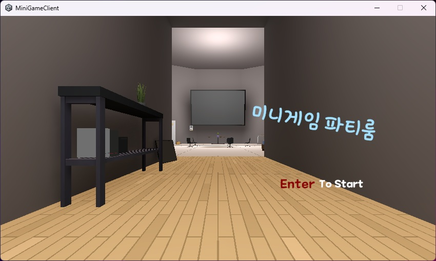
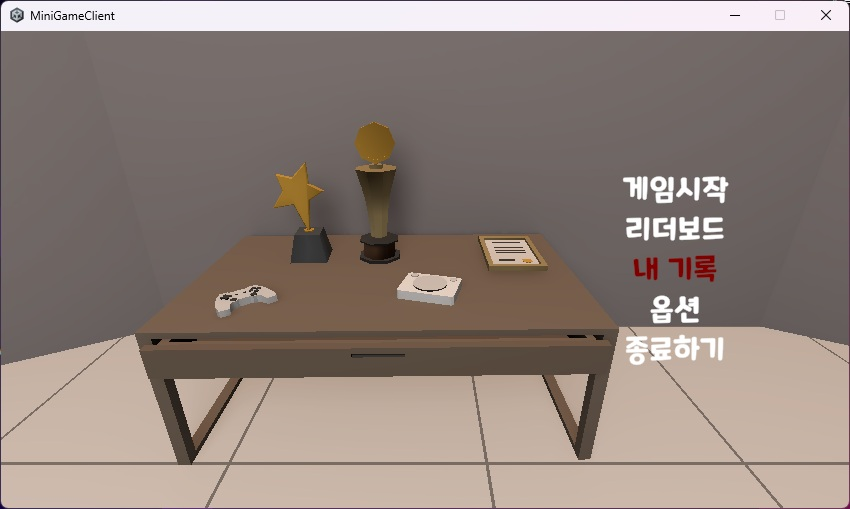
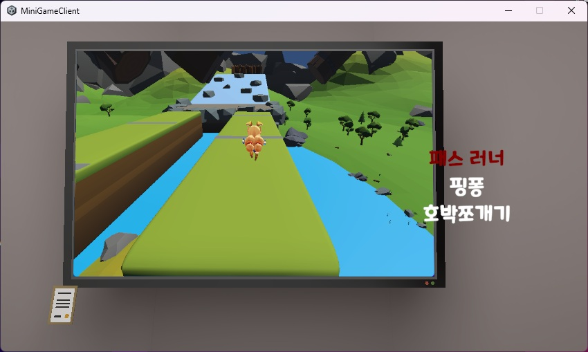
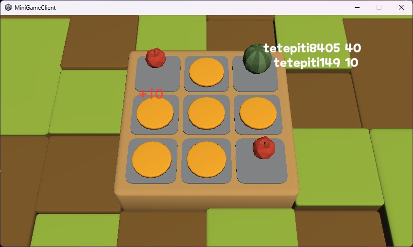

# 김보연 Portfolio

<table>
  <tr>
    <td rowspan="2" width="175" valign="top">
      
    </td>
    <td valign="top">
      <strong>게임 서버사이드 개발자를 지향하며, 멀티플레이어 게임을 직접 개발하고 있습니다.</strong>
        
      서버와 클라이언트를 모두 경험하며 게임의 전체 흐름을 이해하고, 직접 구현해보며 기본기를 다지고 있습니다.  
      이를 바탕으로 상황과 역할에 유연하게 대응할 수 있는 개발자를 목표로 합니다.
    </td>
  </tr>
  <tr>
    <td valign="bottom">
      <b>기술 스택</b> : C++ · C# · Unity · IOCP · io_uring · Linux · Node.js · Redis · MySQL 
      <b>인프라</b> : Oracle Cloud · AWS · Cloudflare
    </td>
  </tr>
</table>

## Projects

### Salvage Protocol

> **멀티플레이어 Extraction Shooter — Client / Server 1인 개발**

| 항목 | 내용 |
|---|---|
| **개발 기간** | 2026.02 ~ 진행 중 |
| **개발 인원** | 1인 |
| **담당 영역** | Client / Server / Networking / Database / Cloud Deployment |
| **주요 기술** | C++17 · C# · Unity · Linux · io_uring · UDP/RUDP · Redis · MySQL |
| **인프라** | Oracle Cloud · MySQL HeatWave · Cloudflare |

Unity 클라이언트부터 Linux 기반 전용 게임 서버까지 직접 설계·구현한 멀티플레이어 Extraction Shooter 프로젝트입니다. 공개 환경에서 동작 중이며, 현재 직접 플레이해볼 수 있습니다.

#### 인게임 스크린샷
|UI|인게임 전투|탈출|
|-|-|-|
||||

#### AI 도구를 활용한 에셋 제작 과정
|컨셉 아트|3D 모델링|리깅 및 애니메이션|Unity 통한 적용|
|-|-|-|-|
|||||

**Links**

- [Server Repository](https://github.com/BoyeonK/ExtractionServer)
- [Client Repository](https://github.com/BoyeonK/ExtractionClient)
- [플레이 영상 - YouTube](https://www.youtube.com/watch?v=wjMVhZvyEE0)
- [Windows 빌드 다운로드](https://drive.google.com/file/d/1jEZZuNcX1D1u2ui_NkjkqWleFZ8hI3tX/view?usp=sharing)

<b>상세 구현 내용 보기</b>

 

#### Server

> 서버에서는 실시간 네트워킹부터 Matchmaking, Dedicated Process 관리, 데이터 계층과 Public Cloud 배포까지 구성했습니다.
> 
> 각 항목의 구체적인 구현 과정과 설계 의도는 Server Repository에 정리했습니다.

- `io_uring` 기반 비동기 네트워크 서버
- Reliable / Unreliable Channel을 지원하는 Custom RUDP
- Main Server / HTTP API Server / Dedicated Game Server 멀티 프로세스 구조
- Dedicated Process 동적 생성 및 GameRoom Capacity 관리
- Redis + Lua Script 기반 Matchmaking 상태 일관성 관리
- Unix Domain Socket 기반 Process 간 IPC
- Redis / MySQL HeatWave 기반 Session 및 영속 데이터 관리
- Oracle Cloud + Cloudflare 기반 실제 외부 접속 환경 구축

#### Client

> Unity / C# 기반으로 로비부터 인게임, 정산까지 전체 게임 플레이 흐름을 직접 구현했습니다.
>
> 실제 플레이 화면과 주요 구현 내용은 Client Repository에서 확인할 수 있습니다.

- Network Worker Thread와 Main Thread Job Queue를 통한 Unity Main Thread 경계 관리
- HTTP REST와 Custom UDP/RUDP를 분리한 Client Networking 구조
- Lobby / Inventory / Shop / Loadout / Matchmaking UI 및 게임 흐름 구현
- Server-authoritative Inventory Snapshot과 Version 기반 상태 동기화
- AI 기반 도구, Tripo3D, Mixamo를 활용한 Character Asset 제작 및 Animation 적용
- 이동, 조준, 반동, 발사 및 상호작용을 포함한 Combat System 구현
- Skeleton Bone 정보를 이용한 Runtime Capsule Hitbox 자동 생성
- Action State Machine을 통한 재장전·무기 교체 등 행동 요청의 상태 관리
- Character State Machine을 통한 캐릭터 행동 상태 제어 및 상황에 맞는 Animation 연출 적용

---

 

 

### MiniGame Partyroom

> **실시간 멀티플레이 미니게임 — Client / Server 1인 개발**

| 항목 | 내용 |
|---|---|
| **개발 기간** | 2025.07 ~ 2026.01 |
| **개발 인원** | 1인 |
| **담당 영역** | Client / Server / Networking / Database / Cloud Deployment |
| **주요 기술** | C++17 · C# · Unity · IOCP · gRPC · Protocol Buffers · SQL Server |

C++ 기반 게임 서버와 Unity 클라이언트를 구성하고, Race, PingPong, 호박쪼개기 3종의 실시간 멀티플레이 미니게임을 구현한 프로젝트입니다.

IOCP Network 구조, Actor 기반 Event Processing, Windows SLIST 기반 Object Pool은 게임 서버 구조를 학습하는 과정에서 익힌 내용을 프로젝트에 적용했습니다. 이를 기반으로 Protocol, DB Gateway, Session 보안, Matchmaking 및 각 MiniGame의 Server / Client Logic을 구성했습니다.

#### 미니게임

| 시작화면 | 메뉴 창 | 게임 선택 | 호박 쪼개기 (인게임) |
|---|---|---|---|
|  ||  |  |

**Links**

- [Repository](https://github.com/BoyeonK/minigame)
- [플레이 영상](<!-- Video URL -->)

<b>상세 구현 내용 보기</b>

 

#### Server

> 게임 서버 구조를 학습하며 익힌 IOCP Network Core와 Actor 기반 Event Processing을 실제 Multiplayer Game에 적용했습니다.
>
> 이를 기반으로 프로젝트에 필요한 DB 연동, Session 보안, Matchmaking 및 게임별 Server Logic을 구성했습니다.

- Overlapped I/O 기반 IOCP Network 구조 학습 및 프로젝트 적용
- Actor Event Queue를 통한 GameRoom 단위 상태 변경 직렬화
- Windows SLIST 기반 Object Pool 구조 적용
- Protocol Buffers 기반 Client / Server Packet Protocol 구성
- Async gRPC 기반 C++ DB Gateway 분리
- ODBC를 통한 SQL Server 연동
- RSA Key Exchange + AES-256-GCM 기반 Session 암호화
- Session State에 따른 Packet Validation 및 비정상 요청 차단
- Elo 기반 Matchmaking 구현
- AWS 환경에서의 Server 배포 경험

#### Client

> Unity / C#으로 Lobby와 3종 MiniGame의 전체 Client Logic을 구현하고, 게임 특성에 따라 서로 다른 상태 동기화 방식을 적용했습니다.

- TCP Socket 기반 Server 통신 및 Protocol Buffers Packet 처리
- Network Thread에서 수신한 작업을 Main Thread Job Queue를 통해 Unity Scene에 전달
- Lobby / Matchmaking / Loading 및 게임별 Network Manager 구성
- Race의 Server State 기반 Player Movement 동기화 및 Client Interpolation
- PingPong의 Object State / Collision Event 기반 동기화
- 호박쪼개기의 Slot State / Hit Event 기반 동기화
- 반복적으로 생성되는 GameObject에 Client-side Object Pool 적용

---
