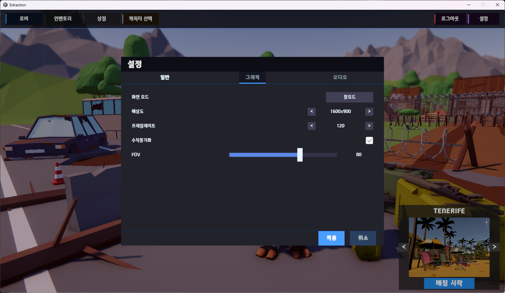
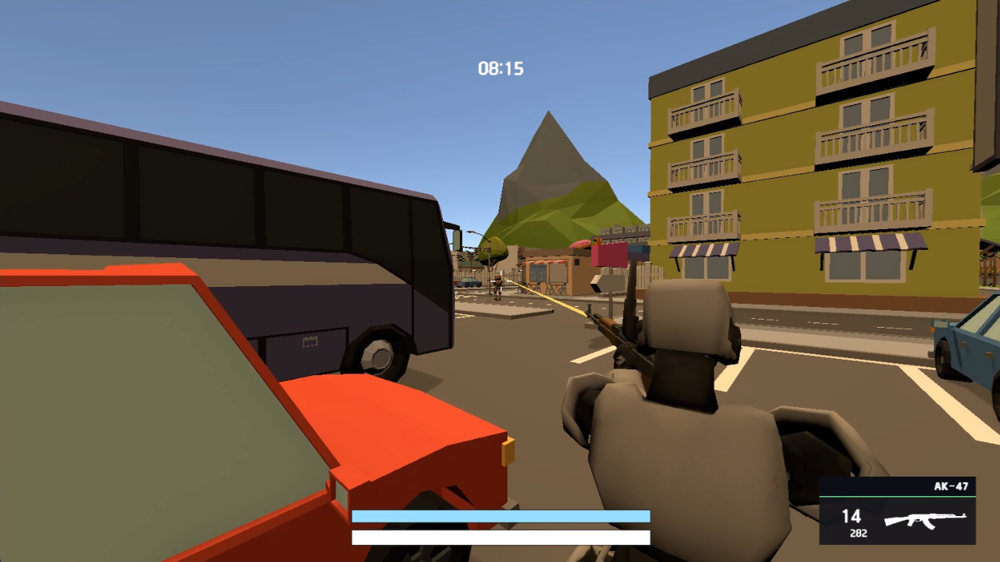
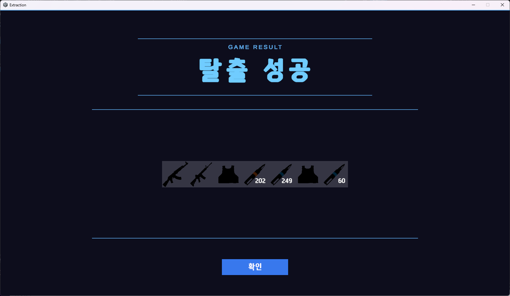
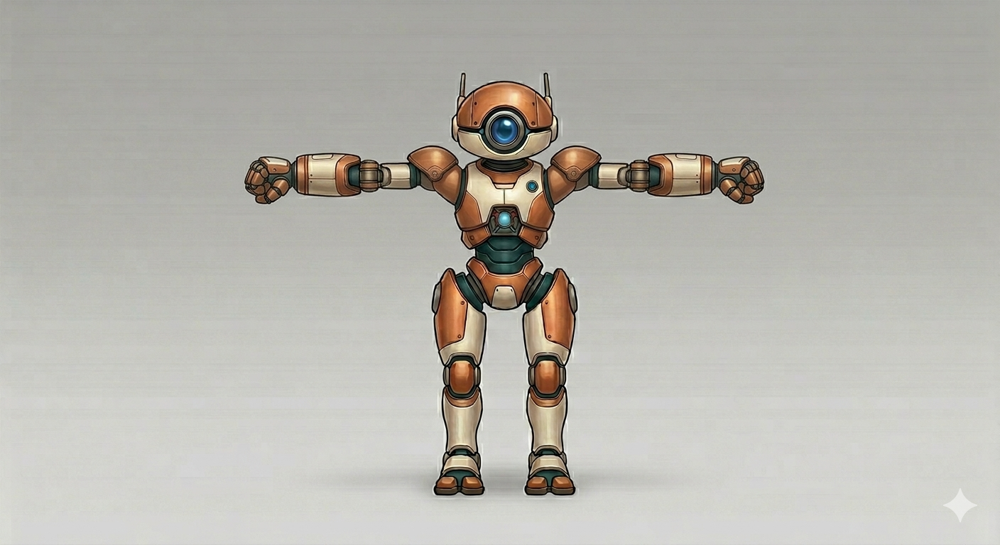
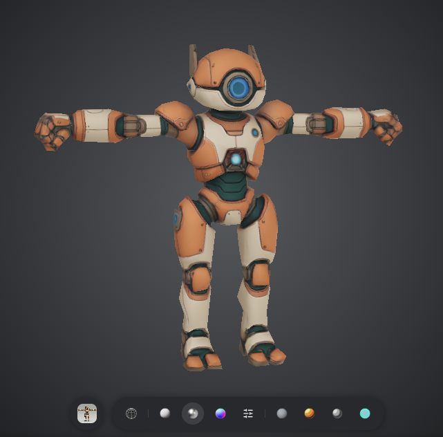
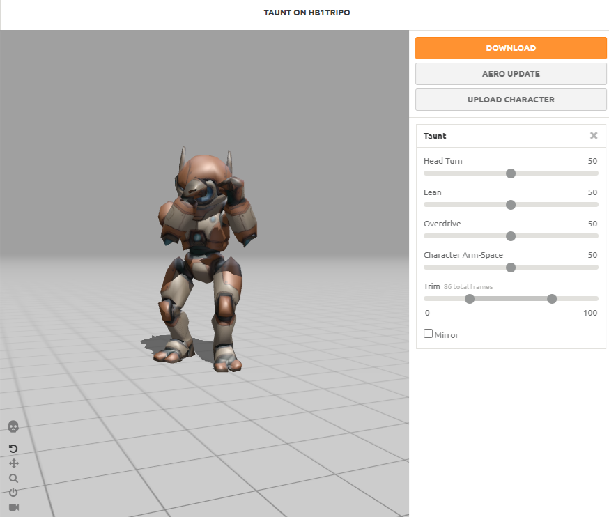
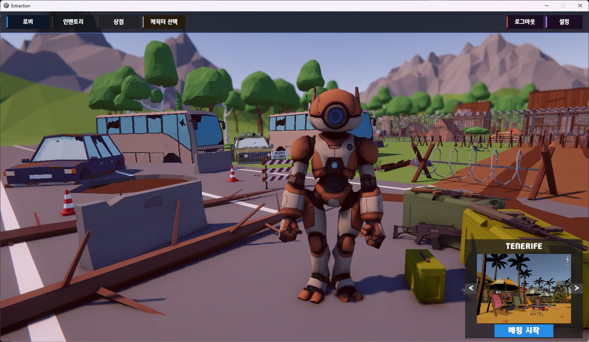

# 김보연 Portfolio

<table>
  <tr>
    <td rowspan="2" width="175" valign="top">
      
    </td>
    <td valign="top">
      <strong>게임 서버사이드 개발자를 지향하며, 멀티플레이어 게임을 직접 개발하고 있습니다.</strong>
        
      서버와 클라이언트를 모두 경험하며 게임의 전체 흐름을 이해하고, 직접 구현해보며 기본기를 다지고 있습니다.  
      이를 바탕으로 상황과 역할에 유연하게 대응할 수 있는 개발자를 목표로 합니다.
    </td>
  </tr>
  <tr>
    <td valign="bottom">
      <b>기술 스택</b> : C++ · C# · Unity · IOCP · io_uring · Linux · Node.js · Redis · MySQL
    </td>
  </tr>
</table>

## Projects

### Salvage Protocol

> **멀티플레이어 Extraction Shooter — Client / Server 1인 개발**

| 항목 | 내용 |
|---|---|
| **개발 기간** | 2026.02 ~ 진행 중 |
| **개발 인원** | 1인 |
| **담당 영역** | Client / Server / Networking / Database / Cloud Deployment |
| **주요 기술** | C++17 · C# · Unity · Linux · io_uring · UDP/RUDP · Redis · MySQL |

Unity 클라이언트부터 Linux 기반 전용 게임 서버까지 직접 설계·구현한 멀티플레이어 Extraction Shooter 프로젝트입니다. 공개 환경에서 동작 중이며, 현재 직접 플레이해볼 수 있습니다.

#### 인게임 스크린샷
|UI|인게임 전투|탈출|
|-|-|-|
||||

#### AI 도구를 활용한 에셋 제작 과정
|컨셉 아트|3D 모델링|리깅 및 애니메이션|Unity 통한 적용|
|-|-|-|-|
|||||

**Links**

- [Server Repository](https://github.com/BoyeonK/ExtractionServer)
- [Client Repository](https://github.com/BoyeonK/ExtractionClient)
- [플레이 영상 - YouTube](https://www.youtube.com/watch?v=wjMVhZvyEE0)
- [Windows 빌드 다운로드](https://drive.google.com/file/d/1jEZZuNcX1D1u2ui_NkjkqWleFZ8hI3tX/view?usp=sharing)

<b>상세 구현 내용 보기</b>

 

#### Server

> 서버에서는 실시간 네트워킹부터 Matchmaking, Dedicated Process 관리, 데이터 계층과 Public Cloud 배포까지 구성했습니다.
> 
> 각 항목의 구체적인 구현 과정과 설계 의도는 Server Repository에 정리했습니다.

- `io_uring` 기반 비동기 네트워크 서버
- Reliable / Unreliable Channel을 지원하는 Custom RUDP
- Main Server / HTTP API Server / Dedicated Game Server 멀티 프로세스 구조
- Dedicated Process 동적 생성 및 GameRoom Capacity 관리
- Redis + Lua Script 기반 Matchmaking 상태 일관성 관리
- Unix Domain Socket 기반 Process 간 IPC
- Redis / MySQL HeatWave 기반 Session 및 영속 데이터 관리
- Oracle Cloud + Cloudflare 기반 실제 외부 접속 환경 구축

#### Client

> Unity / C# 기반으로 로비부터 인게임, 정산까지 전체 게임 플레이 흐름을 직접 구현했습니다.
>
> 실제 플레이 화면과 주요 구현 내용은 Client Repository에서 확인할 수 있습니다.

- Network Worker Thread와 Main Thread Job Queue를 통한 Unity Main Thread 경계 관리
- HTTP REST와 Custom UDP/RUDP를 분리한 Client Networking 구조
- Lobby / Inventory / Shop / Loadout / Matchmaking UI 및 게임 흐름 구현
- Server-authoritative Inventory Snapshot과 Version 기반 상태 동기화
- AI 기반 도구, Tripo3D, Mixamo를 활용한 Character Asset 제작 및 Animation 적용
- 이동, 조준, 반동, 발사 및 상호작용을 포함한 Combat System 구현
- Skeleton Bone 정보를 이용한 Runtime Capsule Hitbox 자동 생성
- Action State Machine을 통한 재장전·무기 교체 등 행동 요청의 상태 관리
- Character State Machine을 통한 캐릭터 행동 상태 제어 및 상황에 맞는 Animation 연출 적용

---

### Minigame Partyroom

추가중

---
